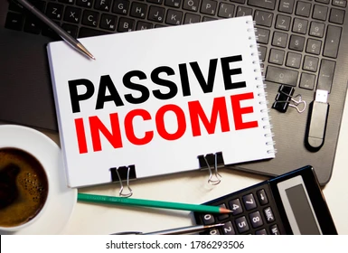

<html lang="en">
<head>
  <meta charset="UTF-8" />
  <meta name="viewport" content="width=device-width, initial-scale=1.0"/>
  <title>Winners Choice</title>
  <link href="https://fonts.googleapis.com/css2?family=Montserrat:wght@400;600;800&display=swap" rel="stylesheet">
  
</head>
<body>

  <header>
    <h1>Winners Choice</h1>
  </header>

  

    

      "Passive income is the path to freedom—build systems that work for you."
    

    

      Welcome to the Winners Choice program—an innovative journey where we guide you in building sustainable, automated income. Through expert strategies, real-world tools, and community mentorship, you'll learn how to invest time wisely today to earn continuously tomorrow. From affiliate marketing to digital investments, we’ve got you covered.
    

    <h2 class="join">Let's Join in This Program</h2>

    

      Your tasks include content sharing, referral building, completing learning modules, and promoting your growth journey through our platform. These activities not only teach you valuable digital skills but also generate continuous rewards. Our support team and mentors are ready to help you get started today! 

      

 ప్రారంభించడానికి తక్కువ పెట్టుబడి:
MLM వ్యాపారాలు ప్రారంభించడానికి పెద్ద పెట్టుబడి అవసరం లేదు, అంటే మీరు తక్కువ పెట్టుబడితో మీ వ్యాపారాన్ని ప్రారంభించవచ్చు.
మీ స్వంత సమయం మరియు షెడ్యూల్:
మీరు మీ స్వంత సమయం మరియు షెడ్యూల్ ప్రకారం పని చేయవచ్చు, అంటే మీకు మీరు స్వతంత్రంగా ఉండవచ్చు.
అపరిమిత ఆదాయం:
MLM ద్వారా మీరు అపరిమితమైన ఆదాయం పొందే అవకాశం ఉంది.

  
  <h1>MLM HISTORY</h1>

  MLM పరిశ్రమకు లాబీయింగ్ గ్రూప్ అయిన డైరెక్ట్ సెల్లింగ్ అసోసియేషన్ (DSA), 1990లో 25% DSA సభ్యులు మాత్రమే MLM వ్యాపార నమూనాను ఉపయోగించారని నివేదించింది. 1999 నాటికి, ఇది 77.3%కి పెరిగింది. [ 28 ] 2009 నాటికి, 94.2% DSA సభ్యులు MLMను ఉపయోగిస్తున్నారు, ఇది 99.6% విక్రేతలు మరియు 97.1% అమ్మకాలను కలిగి ఉంది. [ 29 ] అవాన్ , ఏరస్ (గతంలో ఎలక్ట్రోలక్స్ USA), టప్పర్‌వేర్ మరియు కిర్బీ వంటి కంపెనీలు అన్నీ మొదట సింగిల్-లెవల్ మార్కెటింగ్ కంపెనీలు, ఆ సాంప్రదాయ మరియు వివాదాస్పదం కాని డైరెక్ట్ సెల్లింగ్ వ్యాపార నమూనాను (MLM నుండి భిన్నమైనవి) ఉపయోగించి తమ వస్తువులను విక్రయించాయి. అయితే, వారు తరువాత బహుళ-స్థాయి పరిహార ప్రణాళికలను ప్రవేశపెట్టి, MLM కంపెనీలుగా మారారు. [ 25 ] DSAలో దాదాపు 200 మంది సభ్యులు ఉన్నారు [ 30 ] అయితే యునైటెడ్ స్టేట్స్‌లో మాత్రమే బహుళ-స్థాయి మార్కెటింగ్‌ను ఉపయోగించే 1,000 కంటే ఎక్కువ సంస్థలు ఉన్నాయని అంచనా వేయబడింది.
  PLEASE UNDERSTAND THE RULE OF MLM,TO GROW YOUR FINANCIAL STATUS
    

     
 <a href="page 2.html"> <button >click for rewards </button></a>
  <section class="ads">
    <h2>start your earning</h2>
    

      <h3>complete your target by refering 10 members!</h3>
      
Limited time offer on all our premium plans. Start today and save big.

    

    

      <h3>Join in Our winners choice whatsapp group</h3>
      
Stay updated with our latest news and exclusive offers. Sign up today!

   
  

    <form id="contactForm">
      <input type="text" id="name" placeholder="Your Name" required />
      <input type="tel" id="mobile" placeholder="Mobile Number" required />
      <input type="email" id="email" placeholder="Email Address" required />
      <textarea id="message" placeholder="Your Message" rows="5" required></textarea>
      <button type="submit">Contact With Us</button>
    </form>
  

  

</body>
</html>
